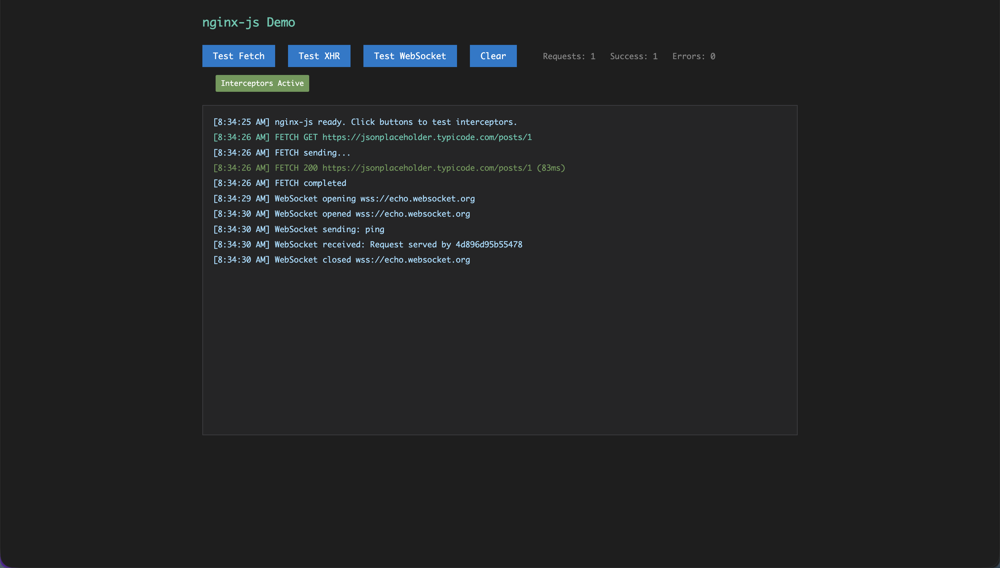
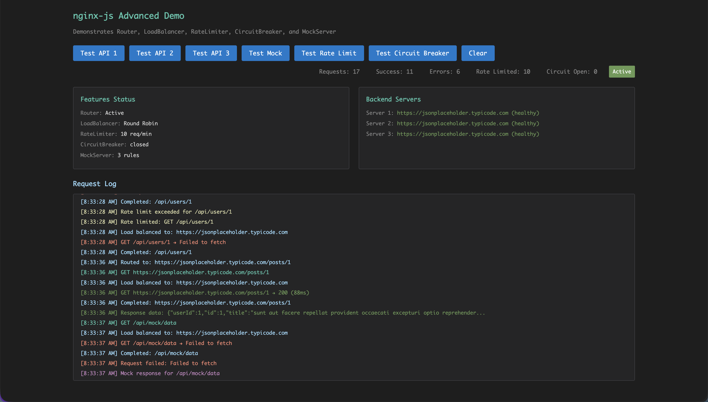

# nginx-js

Nginx-like request proxy for browsers with plugin architecture

[](https://www.npmjs.com/package/nginx-js)
[](https://opensource.org/licenses/MIT)

## Overview

nginx-js provides a comprehensive solution for intercepting and managing network requests in browser environments. Built with a plugin-based architecture, it offers enterprise-grade features including routing, load balancing, rate limiting, and circuit breaking.

## Core Capabilities

**Intercept & Control** - Intercept all browser network requests (Fetch, XHR, WebSocket) with full lifecycle hooks

**Plugin Architecture** - Extensible plugin system for custom interceptors and business logic

**Enterprise Features** - Router, LoadBalancer, RateLimiter, CircuitBreaker, MockServer

## Use Cases

- **API Gateway** - Route requests, load balance, and manage multiple backends
- **Request Monitoring** - Log, trace, and analyze all network traffic
- **Development Mocking** - Mock API responses for testing and development
- **Rate Limiting & Protection** - Prevent abuse with rate limiting and circuit breakers
- **Request Transformation** - Modify headers, rewrite URLs, add authentication

## Notice

> **Note**: This package is currently under active development. The npm package may not be available yet. Please check the repository for the latest status and installation instructions.

## Installation

```bash
npm install nginx-js
```

## Quick Start

```typescript
import {
  InterceptorManager,
  FetchInterceptorPlugin,
  XHRInterceptorPlugin,
} from 'nginx-js';

const interceptor = new InterceptorManager({
  onBeforeRequest: (ctx) => console.log(`Request: ${ctx.method} ${ctx.url}`),
  onAfterResponse: (ctx, res) => console.log(`Response: ${res.status}`),
});

const pluginManager = interceptor.getPluginManager();

interceptor
  .use(new FetchInterceptorPlugin(pluginManager, {}))
  .use(new XHRInterceptorPlugin(pluginManager, {}))
  .start();

// All requests are now intercepted
fetch('https://api.example.com/data');
```

## Enterprise Features

### Router - Request Routing

```typescript
import { createRouter } from 'nginx-js/features';

const router = createRouter()
  .addRule({
    name: 'api-users',
    pattern: /^\/api\/users\/(.+)$/,
    target: (ctx, matches) => `https://users-api.com/users/${matches?.[1]}`,
  })
  .build();

// Use in interceptor
onBeforeRequest: (ctx) => {
  const match = router.match(ctx);
  if (match) ctx.url = match.targetUrl;
}
```

### LoadBalancer - Distribute Traffic

```typescript
import { LoadBalancer, BalanceStrategy } from 'nginx-js/features';

const lb = new LoadBalancer(BalanceStrategy.ROUND_ROBIN);
lb.addServer({ url: 'https://api1.com', weight: 1 });
lb.addServer({ url: 'https://api2.com', weight: 2 });

const server = lb.getNextServer(ctx);
```

### RateLimiter & CircuitBreaker

```typescript
import { RateLimiter, CircuitBreaker } from 'nginx-js/features';

const rateLimiter = new RateLimiter({
  maxRequests: 100,
  windowMs: 60000,
});

const circuitBreaker = new CircuitBreaker({
  failureThreshold: 0.5,
  resetTimeout: 30000,
});

// Check in interceptor
if (!rateLimiter.allowRequest(ctx)) throw new Error('Rate limited');
if (circuitBreaker.getState() === 'OPEN') throw new Error('Circuit open');
```

### MockServer - API Mocking

```typescript
import { MockServer } from 'nginx-js/features';

const mockServer = new MockServer();
mockServer.addRule({
  name: 'mock-users',
  pattern: /^\/api\/users$/,
  response: { users: [] },
  delay: 100,
});

// Use in interceptor
const mockResponse = await mockServer.match(ctx);
if (mockResponse) return mockResponse;
```

## Custom Plugins

```typescript
import { BasePlugin } from 'nginx-js/plugins';

class AuthPlugin extends BasePlugin {
  name = 'auth-plugin';
  
  async beforeRequest(ctx: RequestContext) {
    ctx.headers['Authorization'] = `Bearer ${token}`;
    return ctx;
  }
}

interceptor.use(new AuthPlugin());
```

## Examples

### Basic Demo



[Basic Demo](./examples/index.html) - Intercepting requests

### Advanced Demo



[Advanced Demo](./examples/advanced.html) - Full feature showcase

## Documentation

TypeScript definitions: [dist/index.d.ts](./dist/index.d.ts)

## License

MIT © [Steven Lee](https://github.com/stevenleep)
